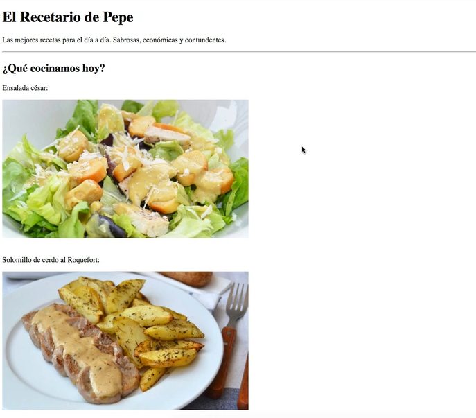
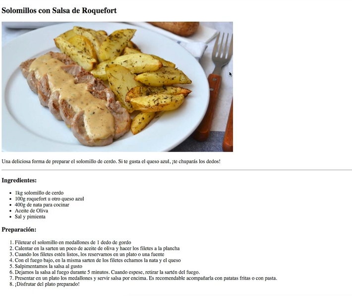
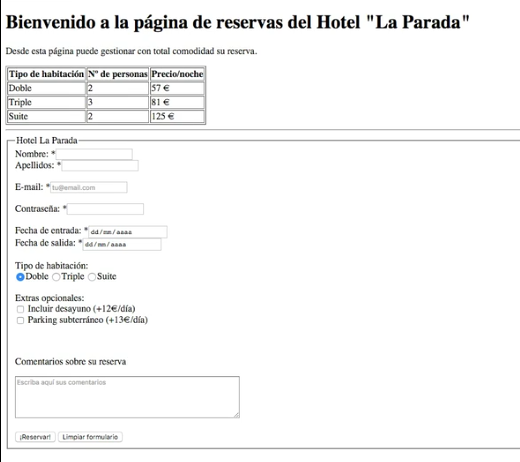

# HTML

## ¿Qué es html?

HyperText Markup Language, Es un lenguaje que se utiliza para crear documentos en la web.

Se encarga de la **estructura semántica** de la página web. A través de etiquetas (tags) podemos estructurar el texto, añadir imágenes, tablas, enlaces, etc,

## Etiquetas y Atributos

### Etiquetas (tags)

Las **etiquetas o tags** son palabras clave para crear la estructura de las páginas.

Van encerrados entre caracteres menor y mayor `<etiqueta>`.

Por lo general los tags son de apertura y cierre `<etiqueta>...</etiqueta>` 

```
    <p>Hola a todos</p>
     ^       ^       ^
     |       |       |
    tag   Content   tag
    open            close
    <<---Elemento HTML--->>
```

> Algunas etiquetas no llevan el tag de cierre p.e. ``.

### Atributos de etiquetas

**Atributos** sirven para añadir mas información a las etiquetas y van dentro de las etiquetas: `<etiq atributo="valor"> ... </etiq>` 

```html
<p lang="es">Hola a todos</p>
```

> Recomendación escribir todo en minusculas

## Estructura HTML

Hay cuatro **etiquetas clave** en todas las páginas web, estas conforman la **estructura básica** y van en un orden específico:

```html
<!DOCTYPE html>
<html lang="es">
	<head>
    	<!-- Contenido de la cabecera -->
        <meta charset="UTF-8">
    	<title>Mi primera web</title>
    </head>
    <body>
    	<!-- Contenido del cuerpo -->   
        Hola mundo!  
    </body>
</html>
```

### Tag Doctype

La etiqueta `<!DOCTYPE html>` debe ser el primer elemento del documento HTML.  Está etiqueta indica al navegador que el documento contiene elementos del estándar HTML5.

### Tag html

El elemento raíz es la etiqueta `<html> ... </html` dentro esta etiqueta van todos los elementos html.

### Tag Head

Etiqueta `<head> ... </head>` dentro de esta se encuentra la **información relevante para el navegador** (metadatos), como el titulo, descripción, autor, keywords, etc. 

> **_Esta información no se visualizará en el navegador_**

#### Codificación del contenido y links

Con la etiqueta `<meta charset="UTF-8">` indicamos al navegador que tipo de codificación de caracteres que se utilizará. 

```html
<meta charset="UTF-8">
```

Las etiquetas `<link>` son una manera de acceder o declarar contenido externo.

```html
<link rel="stylesheet" href="styles.css" />
```

### Tag Body

**Etiqueta body** dentro de esta etiqueta estará **todo el contenido que se visualizará** en la ventana del navegador `<body> ... </body>`

### Comentarios

No se visualizarán en el navegador.

```html
<!-- Esto es un comentario -->
```

### Ejercicio 1

Crear una página web con la estructura básica, título, contenido (solo texto) y comentarios.

## Textos

### Cabeceras y párrafos

**Cabeceras** se usan para los títulos de la página. Tiene 6 niveles, el primer nivel es`<h1>...</h1>`, luego `<h2>...</h2>` y asi sucesivamente hasta `<h6>...</h6>`

**Párrafos** `<p>Contenido del párrafo</p>`

```html
<!DOCTYPE html>
<html>
	<head>
        <meta charset="UTF-8">
    	<title>Cabeceras y párrafos</title>
    </head>
    <body>
    	<h1>Título de nivel 1</h1>
        <p>Esto es el contenido de un párrafo</p>
    </body>
</html>
```

### Saltos de linea

Al momento de visualizar una página, **los saltos de linea y espacios (dos o mas consecutivos) no serán tomados en cuenta por navegador** y solo tomará un espacio respectivamente.

Para **visualizar los saltos de linea** usan las etiquetas `<br>` (tag sin cierre)

```html
<!-- estructura básica -->
<h1>Título de nivel 1</h1>
<p>Esto mi primer párrafo</p>
<br> <!-- esto colocará un espacio adicional entre párrafos-->
<p>Segundo              párrafo</p>
<!-- no se toma en cuenta varios espacios seguidos -->
<p>
    Parra con multiples lineas,
    sigue siendo la primera linea,
    <br> <!-- Obliga a colocar un salto de linea -->
    esto es la segunda linea.
</p>
```

### Salto con Linea Horizontal

```html
<!-- estructura básica -->
<h1>Título de nivel 1</h1>
<hr> <!-- Añade una linea horizontal -->
<p>Esto mi primer párrafo</p>
```

### Strong y em

Etiquetas sirven para **remarcar semánticamente** los textos.

*Strong* es para indicar que un texto es importante `<strong>...</strong>`.

Y *em* para dar énfasis a un texto `<em>...</em>`.

> No utilizar para colocar en negrita o cursiva, en su lugar se hace con css.

```html
<!-- estructura básica -->
<p>Esto mi primer párrafo <strong>esto es importante</strong></p>
```

### Acrónimos y abreviaturas

```html
<!-- estructura básica -->
<!-- Acrónimos -->
<p>Las <acronym title="Base de Datos">BD</acronym> sirven para almacenar datos relacionados</p>

<!-- Abreviaturas -->
<p>El <abbr title="Ingeniero">Ing.</abbr> Ramirez es experto en Redes</p>
```

> A nivel de sintaxis son similares pero a nivel semántico son diferentes.

### Citas, definiciones y direcciones ¿?¿?¿

**Citas** para citar frases, libros, peliculas, etc,

```html
<!-- estructura básica html -->
<!-- Citas -->
<p><cite>El quijote</cite>, obra de Cervantes, es considerado el primer libro de la era moderna. </p>

<!-- definiciones -->
<p>El <dfn>hiperespacio</dfn> es una forma que tiene cuatro o más dimensiones. </p>

<!-- direcciones -->
<address>
    <p>
        Carlos Ramos<br>
        Calle E. Arce<br>
        Cochabamba, Bolivia
    </p>
</address>
```

> A nivel de sintaxis son similares pero a nivel semántico son diferentes.

### Ejercicio 2

Crear la siguiente estructura con tags html.


## Listas, enlaces e imágenes

### Listas ordenadas y desordenas

Las **listas ordenadas** se usan cuanto los elementos tienen un orden. En las **listas desordenas** el orden no importa.

```html
<!-- listas ordenadas -->
<ol> <!-- ordered list -->
    <li>Item 1</li>
    <li>Item 2</li>
</ol>

<!-- listas desordenadas -->
<ul> <!-- unordered list -->
    <li>Item 1</li>
    <li>Item 2</li>
</ul>

<!-- listas anidadas -->
<ul>
    <li>Item 1</li>
    <li>Item 2
    	<ol>
            <li>Item 2.a</li>
            <li>Item 2.b</li>
        </ol>
    </li>
</ul>
```

### Listas de definición ¿?¿? BUSCAR SI SE USA O YA NO

```HTML
<!-- listas de definiciones -->
<dl> <!-- definition list -->
    <dt>Titulo</dt>
    <dd>Descripcion de la definición</dd>
</dl>
```

### Enlaces

Los enlaces o links sirven para la **navegación entre páginas internas de un sitio web**, o navegar entre **páginas web** externas.

```html
<!-- Páginas internas -->
<a href="quienes-somos.html">¿Quienes somos?</a>

<!-- Páginas web externas -->
<a href="www.google.com">Ir a Google</a>
```

Abrir el enlace en una nueva pestaña.

```html
<!-- Abrir el enlace en una nueva pestaña -->
<a href="www.google.com" target="_blank">Ir a Google</a>
```

Navegar entre **zonas de una misma página.**

```html
<!-- Moverse a una zona de la misma página -->
<!-- Primero definir el id en la zona destino -->
<p id="prologo">
    Aquí esta el resumen ... 
</p>
...
<a href="#prologo" >Ir al prólogo</a>
```

Se puede combinar las páginas y las zonas.

```html
<a href="historia-web.html#prologo" >Ir al prólogo</a>
```

### Imágenes

Breve referencia sobre los atributos de img

+ **src** (source), Indica la ruta donde se encuentra la imagen.
+ **alt** para una descripción de lo que contiene la imagen.
  *Es importante no olvidarlo para los lectores de pantalla.*
+ width = ancho de la imagen. Podemos referenciarlo en píxeles o en %
+ height = alto de la imagen. Podemos referenciarlo en píxeles o en %

> No se recomienda definir los atributos width y height, esto se define con css

```html

```

### Ejercicio 3

Hacer un recetario, crear dos páginas

Página 1 - las imágenes son enlaces, imagen 1 enlace a una página externa, la imagen 2 es un enlace a una página interna.



Página 2 - Reseta



## Tablas y Formularios

### Tablas

Las tablas tienen filas y columnas.

```html
<!-- Tabla de 2 x 2 -->
<table>
    <tr>
        <th>cabecera 1</th>
        <th>cabecera 2</th>
    </tr>
    <tr>
        <td>celda 1</td>
        <td>celda 2</td>
    </tr>
    <tr>
        <td>celda 3</td>
        <td>celda 4</td>
    </tr>
</table>
```

Combinación de celdas

```html
<table>
    <tr>
    	<th>Col 1</th>
    	<th colspan="2">Col 2 y 3</th>
    </tr>
    <tr>
		<td rowspan="2">dato 1 y 4</td>
		<td>dato 2</td>
    	<td>dato 3</td>
    </tr>
	<tr>
		<td>dato 5</td>
    	<td>dato 6</td>
    </tr>
</table>
<!-- 
|----------|-------------------!
| Col 1    | Col 2 y 3         |
|----------|-------------------!
| dato 1   | dato 2  | dato 3  |
| y 4      | --------|---------|
|          | dato 5  | dato 6  |
|----------| --------|---------|
-->
```

### Formularios

Son campos por donde podemos enviar información.

```html
<form>
    <!-- Campos de texto -->
    <fieldset>
    	<legend>Título del fomulario</legend>
        <label for="text1">text (placeholder)</label>
        <input type="text" name="name1" id="text1" placeholder="Escribe tu nombre de usuario">
        <br>
        <label for="text3">text (required)</label>
        <input type="text" name="name3" id="text3" required>
        <br>
        <label for="text4">text (pattern)</label>
        <input type="text" name="name4" id="text4" pattern="\S{5,10}" placeholder="(5-10) caracteres">
        <br>
        <label for="text2">text (readonly)</label>
        <input type="text" name="name2" id="text2" readonly value="por defecto">
        <br>
        <label for="email">email</label>
        <input type="email" name="email" id="email">
        <br>
        <label for="passw">password</label>
        <input type="password" name="contrasena" id="passw">
        <br>
        <label for="textA">textarea</label>
        <textarea id="textA" name="comentario" rows="3" cols="20"></textarea>
    </fieldset>
    
    <!-- Botones -->
    <fieldset>
        <legend>Tipo radio</legend>
        <input type="radio" name="ejemploRadio" value="op1">
        <label>opcion 1</label>
        <input type="radio" name="ejemploRadio" value="op2" checked>
        <label>opcion 2 (checked)</label>
        <input type="radio" name="ejemploRadio" value="op3" disabled>
        <label>opcion 3 (disabled)</label>
    </fieldset>
    <fieldset>
        <legend>Tipo checkbox</legend>
        <input type="checkbox" name="ejemCB[]" value="op1" checked>
        <label>opcion 1 (checked)</label>
        <input type="checkbox" name="ejemCB[]" value="op2">
        <label>opcion 2</label>
    </fieldset>
    <fieldset>
        <legend>Tipo select</legend>
		<select name="ejemSelect">
            <option value="item1">Item 1</option>
            <option value="item2" selected>Item 2</option>
        </select>        
    </fieldset>
    <fieldset>
        <legend>Otros tipos</legend>
		<input type="date" name="fecha">
        <input type="number" name="cantidad">
    </fieldset>
    <input type="submit" name="enviar" value="Guardar">
    <input type="reset" value="Limpiar campos">
</form>
```

### Ejercicio 4

Reserva de hotel



## Estructura avanzada

### Elementos block e inline

**Block**: Los elementos block **empiezan en una nueva linea**, es decir, que tienen un salto de linea antes del elemento.

```html
<h1>Titulos 1</h1>
<h2>Titulos 2</h2>
 ...
<h6>Titulos 6</h6>
<p>parrafos</p>
 
<!-- Resultado
Titulos 1
Titulos 2
 ...
Titulos 6
parrafos
-->
```

**inline**: Los elementos inline se **posicionan en la misma linea**, es decir, no inserta un salto de linea antes del elemento

```html

<a href="#">Enlace</a>
<strong>resaltado</strong>
<em>enfasis</em>
otros

<!-- Resultado
-------
| img |
------- Enlace resaltado enfasis
-->
```

### Atributos id y class

Los **id's** identifican elementos de **manera única** *(no deberia haber dos id's iguales)*.

Las **clases** identifican elementos que tienen **características comunes**.

```html
<h1 id="cabeceraPrincipal">Mi Título</h1>
<p id="parrafo1">
    Esto es el parrafo 1 ...
</p>
<p class="texto-gris">
    Esto es está con texto color gris ...
</p>
<p id="parrafo3" class="texto-gris borde">
    Esto es el parrafo 3 y tiene el texto color gris y con borde ...
</p>
```

### Div y span

La etiqueta `div` (division) permite **agrupar elementos o definir una sección** con la finalidad de aplicar estilos. Div es un elemento **block**.

```html
<div class="contenido">
    <p>Esto es el parrafo 1 ...</p>
	<p>Esto es el parrafo 2 ...</p>
</div>
```

La etiqueta `span` es un elemento ***inline*** y permite **definir una "subsección"** generalmente de elementos block para aplicar estilos.

```html
<p>
    <span class="capital">L</span>orem ipsum dolor sit amet adipiscing mi tempor eros litora ullamcorper, <span class="resaltado">elit neque</span> , eget dis nascetu.
</p>
```

### Ejercicio 5

Crear la estructura de un blog

```
-------------------------------------------------------
         LOS VIAJES DE JULIA
             <Subtitulo>
-------------------------------------------------------
	| MENÚ | DE | NAVEGACIÓN | USAR | TAGS-<ul>
=======================================================
				<ESPACIO PARA LOS POSTS>
	--------------------------------------------
			Título del post1
		|-----------------------|
		|	<imagen del post>	|
		|						|
		|-----------------------|
		<fecha-pub> | <categorias>
		Descripción del posts1 va
		en esta sección ...
		|-----------------------|
		|	<tabla de precios>	|
		|		|		|   	|
		|-----------------------|
		Último parrafo del post1
	--------------------------------------------
	--------------------------------------------
			Título del post2
		|-----------------------|
		|	<imagen del post>	|
		|						|
		|-----------------------|
		<fecha-pub> | <categorias>
		Descripción del posts2 va
		en esta sección ...
	--------------------------------------------
======================================================
		       <GALERIA DE FOTOS>
	|--------------------|--------------------|
	|                    |                    |
	|                    |                    |
	|                    |                    |
	|                    |                    |
	|--------------------|--------------------|
	|                    |                    |
	|                    |                    |
	|                    |                    |
	|                    |                    |
	|--------------------|--------------------|
	
=======================================================
Suscríbete ...
-------------------------------------------------------
|  Nombre: |____________|  Email: |______________|  
|  Acepto las condiciones |_|    |__Suscribirme__|
-------------------------------------------------------
```

## Etiquetas semánticas

En la especificación de **HTML5** se introdujeron una serie de etiquetas nuevas con cierto sentido semántico (**etiquetas semánticas**), estas etiquetas d**escriben el significado de su contenido**. 

Este tipo de etiquetas que componen la web semántica nos sirven para que cualquier mecanismo automático (un navegador, un motor de búsqueda, un lector de *feeds*...) que lea una página web sepa con exactitud la ubicación de las partes que la componen.


### Header

La etiqueta `<header>` es para la sección de la cabecera (la parte superior de un una página), dentro de esta etiqueta está el logotipo, título de la página, podría contener también el menú de navegación, un campo de búsqueda, etc,

```html
<header>
    <a href="/"></a>
    <h1>Title</h1>
</header>
```

> No confundir `<head>` con la etiqueta `<header>`

### Nav

> *El elemento* `<nav>` *representa una sección de una página que enlaza con partes de la misma página u otras páginas: menú de navegación.*

La etiqueta `<nav>` es para la zona de navegación, contiene enlaces a las páginas principales del sitio web (**menú de navegación**),

```html
<nav>
    <ul>
        <li><a href="#">home</a></li>
        ...
        <li><a href="#">gallery</a></li>
    </ul>
</nav>
```

### Footer

La etiqueta `<footer>` representa el pie de página, En esta sección generalmente se coloca enlaces a otras web relacionadas, descripción del copyright, enlace a políticas de privacidad, etc.

```html
<footer>
    <p>Derechos reservados ... </p>
</footer>
```

### Article

La etiqueta `<article>` se utiliza para **encapsular contenido**, Puede ser un post de un foro, un artículo de un periódico o revista, una entrada de un blog, un comentario de un usuario, un widget o cualquier otro elemento independiente.

```html
<section>
    <h1>Comments</h1>
    <article id="c1">
        <p>Yeah! Especially when talking about yours friends</p>
    </article>
    <article id="c2">
        <p>Hey, you have the same first name as me.</p>
    </article>
</section>
```

### Section

> *Representa una sección genérica de un documento. Una sección, en este contexto, **es un grupo temático de contenido**, que generalmente incluye una cabecera.*

Se utiliza para dividir el documento en secciones p.e.

+ La últimas novedades del foro.
+ En una página de venta de productos, una sección muestra los productos y otra sección la "Formas de pago".
+ Una sección de comentarios.

> También un section podría ser tan grande como para poder contener incluso header, footer, etc.

### Aside

Las etiquetas `<aside>` son para todo aquel contenido que **no esta directamente relacionado con el tema principal** del que esta tratando la página.

Sirven por tanto para todos aquellos elementos secundarios, como podrían ser los bloques publicitarios, enlaces externos, citas, un calendario de eventos, etc,

```html
<aside>
  <h1>Publicidad<h1>
  ...
</aside>
```

### Figure

Gracias a la etiqueta `<figure>` podemos contener una imagen (o un vídeo, ilustración o bloque de código) en un elemento y relacionarlo con un contenido concreto:

```html
<figure>
    
    <figcaption>
        Bruce and Remy welcome questions
            <small>Photo &copy; Bruce’s mum</small>
    </figcaption>
</figure>
```

### Hgroup y time ¿?¿?¿=¿SE USA?

`<hgroup></hgroup>`: representa el encabezado de una sección. El elemento se utiliza para agrupar un conjunto de elementos `h1-h6` cuando el título tiene varios niveles, tales como subtítulos o títulos alternativos.

```html
<hgroup>
    <h1>Title</h1>
    <h2 class="tagline">
        A lot of effort went into making this effortless.
    </h2>
</hgroup>
```


`<time>`: representa o bien una hora (en formato de 24 horas), o una fecha precisa en el calendario gregoriano (en formato [ISO](http://es.wikipedia.org/wiki/ISO_8601))

```html
<time datetime="2009-10-22">October 22, 2009</time>
```

### Ejemplo

```html
<!DOCTYPE html>
<html>
<body>
    <header>
        <a href="/"></a>
        <hgroup>
            <h1>Title</h1>
            <h2 class="tagline">
                A lot of effort went into making this effortless.
            </h2>
        </hgroup>
    </header>
    <nav>
        <ul>
            <li><a href="#">home</a></li>
            <li><a href="#">blog</a></li>
            <li><a href="#">gallery</a></li>
            <li><a href="#">about</a></li>
        </ul>
    </nav>
    <section class="articles">
        <article>
            <time datetime="2009-10-22">October 22, 2009</time>
            <h2>
                <a href="#" title="link to this post">Travel day</a>
            </h2>
            <div class="content">
                Content goes here...
            </div>
            <section class="comments">
                <p><a href="#">3 comments</a></p>
            </section>
        </article>
    </section>
    <aside>
        <div class="related"></div>
        <div class="related"></div>
        <div class="related"></div>
    </aside>
    <footer>
        <p>&#167;</p>
        <p>&#169; 2013&#8211;9 <a href="#">Arkaitz Garro</a></p>
    </footer>
</body>
</html>
```

### Ejercicio 6

Convertir a tags semanticos.

## Caracteres especiales

Algunos caracteres no se puede visualizar en el navegador porque forma parte de la sintaxis de html.

Algunos caracteres especiales son:

```html
Menor que: &lt;
Mayor que: &gt;
Ampersand: &amp;
Comillas dobles: &quot;
space: &nbsp;
			    
Signo del euro: &euro;
Signo de la libra: &pound;
Signo del centavo: &cent;
Signo del yen: &yen;

Copyright: &copy;
Marca registrada (R) &reg;
Marca registrada (TM) &trade;

Comilla única izquierda: &lsquo;
Comilla única derecha: &rsquo;
Comilla doble izquierda: &ldquo;
Comilla doble derecha: &rdquo;

Multiplicación: &times;
División: &divide;
```

https://www.w3schools.com/html/html_entities.asp

https://www.w3schools.com/html/html_symbols.asp

https://www.w3schools.com/html/html_emojis.asp

## Bibliografía

1. https://html5doctor.com/#glossary descripción de las etiquetas y snippets

2. Curso de html y css 2018 - Udemy
